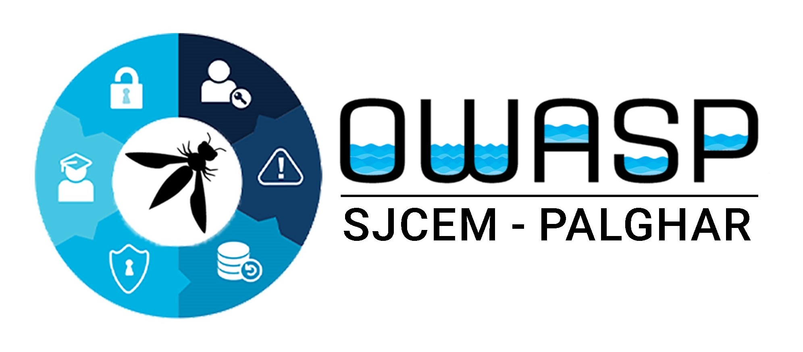

---

layout: col-sidebar
title: OWASP St. John College of Engineering and Management
tags: Palghar
region: Asia
meetup-group:

---

## Welcome
St. John College of Engineering and Management (SJCEM) provides facilities for professional education in the rural and tribal area of Palghar District near Mumbai by offering professional engineering and management courses with  the following
#### Vision: “Excellence in Engineering Education & Creating Next-Gen Leaders / Managers in the Service of Society” 
The college is situated within a lush green campus in a serene and quiet ambience at the St John Technical Education Complex, located at Vevoor, Palghar (East), district Palghar in Maharashtra. Palghar is a part of Mumbai Suburban Rail Network which extends up to Dahanu and lies on the Mumbai- Ahmedabad rail route 30 kms north of Virar.

## UPCOMING EVENT
Join us for the 2023 Inaugural Meetup of OWASP Chapter at St. John College of Engineering and Management, Palghar. This event is designed for students, faculties, and professionals interested in cybersecurity and related areas. The meetup features four distinguished speakers who will share their insights on cybersecurity and the latest industry trends, along with highlighting the contribution of OWASP in this domain. Additionally, the event offers networking opportunities for knowledge expansion and interaction with like-minded individuals. Don't miss this chance to connect with experts and stay updated on the evolving world of cybersecurity!
* [Details of the Event](https://owasp.org/www-chapter-st.-john-college-of-engineering-and-management/#div-nextevent)

## Participation
The Open Worldwide Application Security Project (OWASP) is a nonprofit foundation that works to improve the security of software. All of our projects, tools, documents, forums, and chapters are free and open to anyone interested in improving application security. 

Chapters are led by local leaders in accordance with the [Chapters Policy](/www-policy/operational/chapters). Financial contributions should only be made online using the authorized online donation button. 

Everyone is welcome and encouraged to participate in our [Projects](/projects/), [Local Chapters](/chapters/), [Events](/events/), [Online Groups](https://groups.google.com/a/owasp.com/){:target='_blank'}, and [Community Slack Channel](https://owasp.slack.com/){:target='_blank'}. We especially encourage diversity in all our initiatives. OWASP is a fantastic place to learn about application security, to network, and even to build your reputation as an expert. We also encourage you to be [become a member](/membership/) or consider a [donation](/donate/) to support our ongoing work.

 <!-- Next Meeting/Event -->
---------------------


